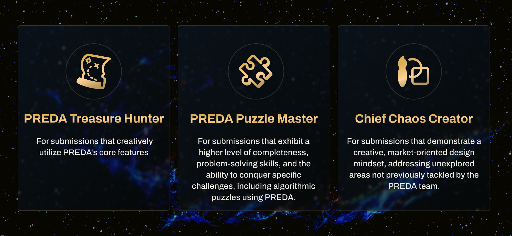
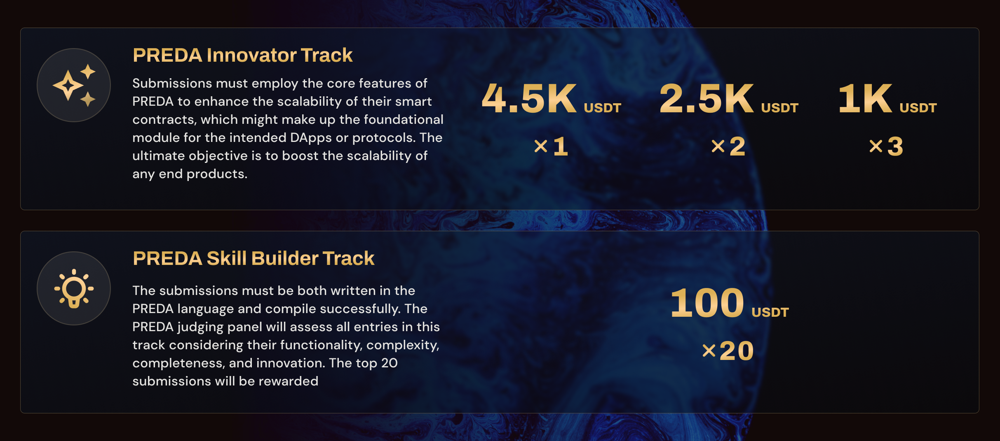

# PREDA Scale-out Smart Contracts Hackathon

## 👏🏻 Welcome to the Hackathon!
Welcome onboard! We're thrilled to introduce you to [**PREDA**](https://www.preda-lang.org/), a revolutionary programming model designed to scale out general smart contracts. This virtual hackathon is tailored for blockchain builders, developers, entrepreneurs, and anyone eager to supercharge the scalability of their DApps and protocols, harnessing the power of PREDA.

By participating in this event, you'll get your hands on powerful tools,  dive into the latest technology sharing, and receive wholehearted support from experts who know the ins and outs of programming with PREDA.

Beyond that, there's a chance for you to snatch a piece of the **10K USDT** reward pie, register for the hackathon now to secure a spot, and be part of this evolution!

## 📣 Introduce [PREDA](https://www.preda-lang.org/)
PREDA is a **novel programming model** for **scaling out any general smart contrac**t. This is achieved by partitioning the smart contract state and dividing the transaction traffic, which are jointly handled by multiple independent virtual machines that can be distributed and parallelized.

We implemented the PREDA model by **extending the Solidity language**, which demonstrates that popular smart contracts with different levels of complexity can be rewritten to gain scalability without taking care of the details of the underlying distributed system.

Check out [our PAPER](https://www.preda-lang.org/pdf/preda-model-sole.pdf) to delve further into PREDA, and how PREDA extends Solidity to achieve significant performance and scalability advantages.

## Register Now 🙌🏼
https://tally.so/r/npojLE

## ❓ Why You Should Join
- Lead the way in the next generation of scalability solutions: Unleash scalability by partitioning smart contracts
- A chance to win a share of 10K USDT
- Connect with like-minded developers & professionals
- Calling challenge lovers to get prepared to conquer puzzles in the blockchain’s “Cuda”!

## 🗓 Key Dates
- Kick-off Session & Workshop: November 18, 2023
- Registration & Team Formation: November 18, 2023 - November 30, 2023
- Submission Period: November 18, 2023 - January 14, 2024
- **Code Assessment** Period: November 18, 2023 - January 19, 2024
- Winner Announcement: January 20, 2024 - January 22, 2024
- Prize Distribution: January 26, 2024

## 🏆 Prize Distribution
1. NFT Giveaway - Show off Your Proof of Being A Part of the PREDA Revolution!

   3 types of NFT giveaways will be distributed to the selected submissions, and the recipients will be granted corresponding Discord roles.

2. A total of 10,000 USDT (**100% in USDT)** in rewards are split between 2 tracks.

## 📚 **Guidelines**
All developers and blockchain project teams are welcome to participate in the event. Projects are more likely to be accepted if they meet the following criteria:

- The code must be written with PREDA

> 💡 The project must utilize the [PREDA toolchain](https://www.preda-lang.org/) and can be successfully compiled with it.

- Participants can apply with existing projects or write new smart contracts using the PREDA programming model and programming language for the competition.
- Projects that make efficient use of **[PREDA core features](https://www.preda-lang.org/pdf/preda-model-sole.pdf)** to enhance scalability are highly valued.
- If you encounter any specific issues during the development process, feel free to join our communities, and we will guide you to the right resources.

## 👨🏻‍🔧 Get Our Support
**PREDA Real-time Support Available:**

- PREDA official Twitter Account: [PREDA (@PREDALang) / X](https://twitter.com/PREDALang)

- PREDA Discord Server: [Discord - A New Way to Chat with Friends & Communities](https://discord.gg/7dAcJK2N)

- PREDA email: [**devteam@preda-lang.org**](mailto:devteam@preda-lang.org)

## 📏 **Judging Criteria**
The judging committee will assess each submission using the following criteria:

- 🧹 Functionality: Examine the quality of code, whether the project performs as intended and offers valuable and practical features.
- 👨🏻‍🎨 Innovation: Evaluate whether the project showcases novel and novel applications of the PREDA programming model.
- ䷂ Technical Difficulty: Assess the level of complexity and challenges involved in implementing the project.

These criteria will guide the judging process to identify exceptional projects that demonstrate novelty, creativity, and practicality to PREDA.

## 👨🏼‍💻 Submission Guide
Submit to our GitHub repository: [GitHub - preda-devteam/HackathonSubmissions](https://github.com/preda-devteam/HackathonSubmissions)

To send a submissions after November 18, 2023 (and before January 19, 2024), just fork this repo and create a PR with your changes. You should create your own subfolder inside `/submissions` (make sure to give it a unique name). Your submissions should contain the following files and information:

 - `README.md`: please describe the smart contract's purpose and the functionality you aim to achieve. Additionally, provide details on how you've leveraged PREDA's core features to enhance the contract's scalability.
 - `About.md`: include here information about yourself and how to contact you.
 - `/code`: create a subfolder with all the code of your submissions.

## 🛠 Developer Resources
1. The shortcut to install PREDA Devkit

   https://github.com/preda-devteam/preda/releases/tag/v0.1.0.3

2. Learn PREDA with **language specs**

   https://github.com/preda-devteam/preda/blob/main/docs/language_specification.pdf

3. Learn PREDA with an interactive **tutorial**

   https://preda-lang.org/puppy/#/

4. Learn PREDA with **smart contract examples**

   https://github.com/preda-devteam/preda/tree/main/oxd_preda/simulator/contracts

## ❓FAQs

- **Can I register with multiple teams or submit multiple projects?**

  Yes. You can be a team member of multiple teams or submit multiple projects. However, we encourage participants to focus on a single project in order to achieve the best results.

- **How many people can be on a team?**

  1-5 people on a team.

- **How will this event take place?**

  This hackathon takes place online, and mentorship and support take place on Twitter and Discord.

- **Do we need to create a frontend for the demo? Are projects required to have a frontend?**

  No, you don't need to have a frontend.

- **Can we submit and modify the demo video link after submission?**

  Yes, you can modify it before the submission deadline.

- **Who owns the IP to the submitted projects?**

  You, the owner or team behind the project owns the IP.
