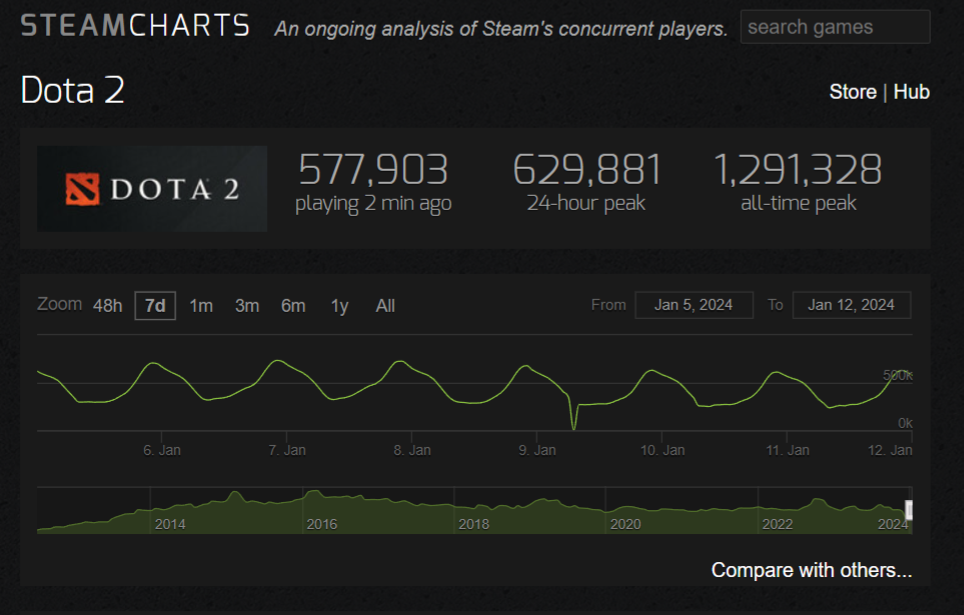
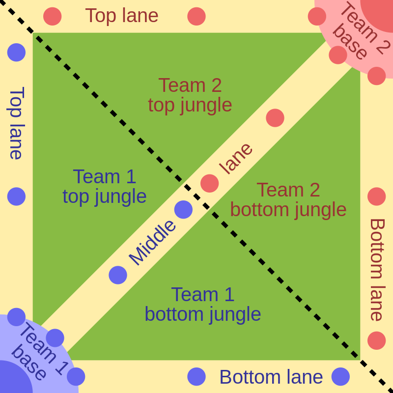
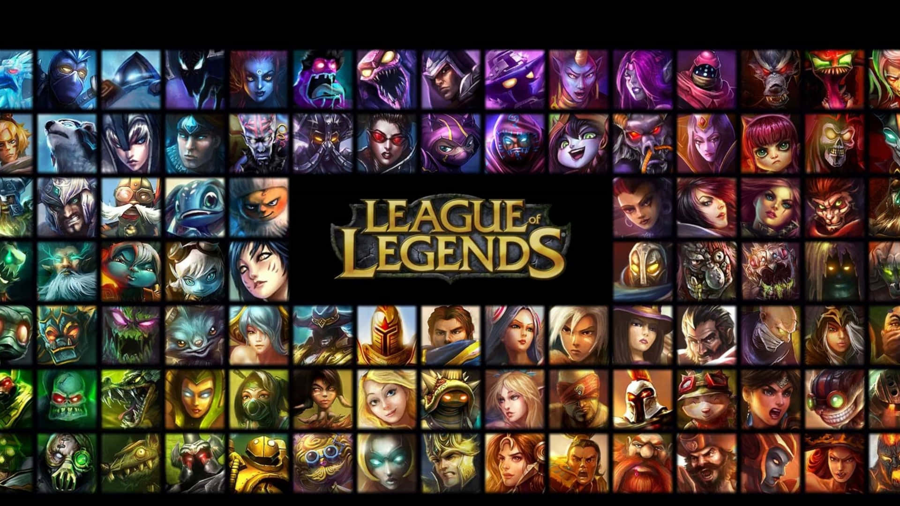
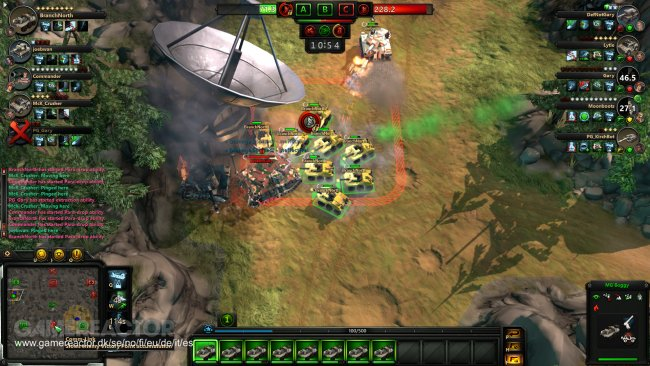

# Moba metaverse
The **blockchain platforms** are the world computers, where changes into the programs is possible only by pre-defined permissions. The world computers enable the games, where game designers won't change the rules for the profit, unless players don't approve it.

> According to the legends, Vitalik Buterin was playing World of Warcraft. One day, Blizzard Studio decided to remove his favorite asset without any notice. Outraged Buterin decided to create the first blockchain platform, Ethereum. With the world computer, the owners of the game wouldn't be able to do whatever they want.

Another problem in the current game industry is the ownership over the game mods. Game studio owns all rights to the items, mods that were created by the players.

The nature of the *blockchain platforms* allows creation of the games, where users could add more items, mods and own them. With the original game studio they may share the royalty by pre-defined rules in the smartcontracts.

> From my understanding the metaverse is only possible if the game is extendable by the community. And any mod, item  is owned by it's creator.

In order to create such kind of the metaverse, it must be a popular game with millions of the players. The most popular games are online, session based games such as *Counter Strike, GTA V Online, League of Legends, Dota 2 and etc*.

Unfortunately, the current blockchain platforms don't allow to create this types of games. It's not even possible if the game has it's own blockchain network. 

*https://steamcharts.com/app/570*

*For example, Dota 2 had 500,000 users playing at the same time. Trying to process 500,000 requests in one queue would make game infinetely slow, therefore impossible to play*.

The PREDA's parallel execution model allows to build such kind of the games. In the example above, assuming that every *Dota 2* session has 10 players, we could parallelyze each session. Instead a half million requests, the nodes would need to parse 9 requests at most, which dramatically improves the game speed.

I present a **Moba game: Sedentary versus Nomads** inspired by *Dota 2*. Using the **Preda to track each session in parallel**, this game theoretically could support as many users as the most played multiplayer games. 

**This is also a community driven metaverse**. The Moba games have heroes, items to craft. In this game, users are able to create their items, heroes and different game mechanics. They own the full right for them. And if they trade the heroes, items in the marketplaces, then they give the royalty fee to the original authors of the Moba.

If the player created battle arena is not for free, then by discussion with the original authors they should give the part of the fees. The discussion is not meant about the permission, but notification about the charging part.

For example, to our game, someone may create a battle arena for **Chinese versus Huns**, or **Chengiz Khan** packs and have the full rights for that.

---

### Other projects
There is also an oracle if the Preda supported blockchain will add oracles.
The smartcontracts are able to fetch off-chain data in an asynchronous way thanks to the Preda model. The code is available at [code/oracle](./code/oracle/).

Also, the game should utilize the state-of-art solutions. To do that, we started migrating the Openzeppelin smartcontracts into the Preda.
In the cases where parallel execution is possible, we were utilizing that.
The code is available at [code/openzeppelin](./code/openzeppelin/).

I won't define here the smartcontracts and what they do, as they are additional tools, not primary tool. Trying to describe all code would make this document too long.

---

# Game rules
Before explaining our game, let's walk through the game mechanics first.
This will give more understanding how the smartcontracts are working.

The game is the battle arena for ten players. They are split into two teams of five players. In this game, one team represents the sedentaries, while the other side represents the nomads. 

*Battle arena map from Wikipedia*

Each team has a base building. The bases are located in the opposing sidesand connected through the three roads. Both sedentary and nomads are spawning armies in every minute. These armies march along the lanes to clash to each other. The game is won, when the opponent's base falls first.

Players pick the hero from the pool.

In our game, we provide the first 100 heroes available for everyone. The game has the **Hero creation** page where users could mint new heroes. Either by creating their own heroes, or buying from the marketplace, users can import custom heroes as well.

The heroes have different ability, different mechanism but equal in the power.

The goal of the players is to help to their army to win against the opponents.

Heroes are getting more powerful, by level increase, or by purchasing items for farmed gold. Along the lanes the parts have the towers that must be destroyed before reaching the base. 

The killing army, destroying buildings or killing heroes give to the hero an experience and gold. The experience is used for the level. The gold is used to craft items.

In our game, we provide 100 items to buy for everyone. The game has **Item alchemy** where users can mint new items. Either created, or obtained from the marketplce, the items maybe added into the game as well.

The moba is defined with the five core parts:
* Gameplay (the core with the initial MOBA gameplay by sessions).
* Hero (NFT that users could create or choose to play the in the game).
* Item (NFT that boosts the hero power in the game)
* Token (a token to purchase the assets in the game. Any modifications, NFTs of this metaverse has to use this token for the payments. The token defines the royalty that goes to the original creators).
* Marketplace (NFT Trading).

## Smartcontracts
As our game is community driven, every hero, item is represented as an NFT.
There could be thousands if not millions possible options of hero, item.
To track which one is better and which one is not, we track the games that were won with the heroes and items. Using this statistics is what increases the value of the item.

During the game, the NFTs can not be traded. Therefore for every session we lock them in. Upon session end, we unlock the NFTs and update the stats as well.

### 1. Hero (`code/hero.prd`)
> For Hero specification check the [Hero.md](./doc/Hero.md).
> Implemented in the [./code/hero.prd](./code/hero.prd)

Unlike other Moba games, in **Sedentary versus Nomads** anyone can create their own hero. We represent the heroes as NFTs.

The heroes have various stats, agilities such as *intelligence, speed, health point* and etc. We define the common value as the sum of all stats.
Let's say all heroes have 1 points.

Then, users may create a hero with `[0.2, 0.2, 0.6]` or `[0.2, 0.5, 0.3]`,
parameters. But in the sum the stats will be equal to the `1 points`. This is defined in the smartcontracts, therefore anyone can create the heroes with the same power but different characteristics.

#### 1.1 Hero Unique features
The Hero NFTs are not the same as in the other blockchains. The NFTs are tracked not globally but by their ID. Therefore, NFTs could be transferred between users, marketplaces or games in parallel.

The default points that users may distribute is 500 points. The global `mint` function is possible to call by anyone. But costs 3000 tokens.

Additionally, it has `transferFromGame` method initiated by the game smartcontracts. Unlike standard `transfer` method, this function also updates the game statistics for the NFT.

### 2. Item (`code/item.prd`)
> For Item specification including the formula by which it's cost is calculate is defined in the [Item.md](./doc/Item.md) page.
> Implemented in the [./code/item.prd](./code/item.prd)

Items increase the hero stats, or adds additional abilities.

*https://dota2.fandom.com/wiki/Gloves_of_Haste*.

For example, the item above from Dota 2 increases the hero attack speed by *20*.

Unlike other Moba games, in **Sedentary versus Nomads** anyone can create their own item.

#### 2.1 Item Unique features
The Item NFTs are not the same as in the other blockchains. The NFTs are tracked not globally but by their ID. Therefore, NFTs could be transferred between users, marketplaces or games in parallel.

The global `mint` function is possible to call by anyone. But there is a cost calculated by the item parameters. The more powerful item is, the higher the cost. That cost is predefined by the smartcontract.
The `mint` will cost as much as the power of the item, as well as in the game the price of the item cost the same amount of in-game GOLD.

Additionally, it has `transferFromGame` method initiated by the game smartcontracts. Unlike standard `transfer` method, this function also updates the game statistics for the NFT.

In the smartcontract, we define the ratio between item cost to the boost that it gives.

#### 2.2 Hero ability
Heroes, besides the statistics have special abilities.
For example jumping for few meters or froze the area. There are four abilities. The three abilities are available in the beginning. The fourth ability is the ultimate one and available only after level 6.

In our game, the hero's abilities are represented as items attached to the heroes.

They normal abilities are the items that worth `500 Token`.  The ultimate ability costs `3000 Token`.

### 3. Game (`code/moba.prd`)
The main game `moba.prd` spawns the session for each game matches.

Each session has two phases. The preparation phase and the game phase.

The preparation phase goes five minutes. In the preparation phase, players are picking the heroes that they will play with. During the preparation phase, players may import the custom items, heroes to make them available.

At the end of the game session, the master will inform the smartcontract about the game status. It's the only part that must be trusted by both parties.
Marking the session end releases the custom heroes and items back to the importers.

The sessions are executed in parallel, because in the Preda they are tracked by the IDs. Then in the preparation phase, users may import their custom items without disrupting other game sessions. The two functions for parallel execution are `import_hero` and `import_item`.

#### 3.1 Future Improvement
The downside of the current moba implementation is that, session creation (`create_session`) is a global function. Which means it slows the initiation of the games. We need to make it based on the session id as well so that we may initiate game sessions in parallel.

### 4. Token (`code/token.prd`)
The **MobaToken** is used to create game assets, and potentially if users are creating another variant of `moba.prd`.
Finally the token is used for the marketplace.

#### 4.1 Royalty
The royalty is defined in the percentage wise and it's always 15%.

If there is a smartcontract that receives the heroes or items, then they must accept the `TOKEN` as their payment system.

> It's subject of organization by the DAO. And not implemented yet, as we don't have any game besides `moba.prd` yet.

#### 5. Marketplace
The marketplace is the part where users can exchange their heroes and items
with other people.

This marketplace didn't implement the Preda execution model yet as we don't think it will be used more often than the game itself.