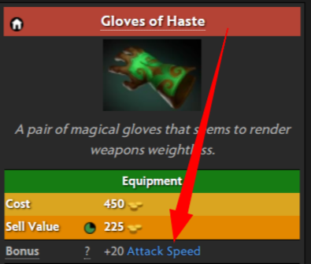

## Item
> Implemented in the [./code/item.prd](./code/item.prd)

Items increase the hero stats, or adds additional abilities.

*https://dota2.fandom.com/wiki/Gloves_of_Haste*.

For example, the item above from Dota 2 increases the hero attack speed by *20*.

Some items defined as the recipe, which is created with the merge of the multiple items. The artifacts created by the recipe has the characteristics of the ingredients.

Unlike other Moba games, in **Sedentary versus Nomads** anyone can create their own item. We represent the items as NFTs.

In the smartcontract, we define the ratio between item cost to the boost that it gives.

---

Items are scriptable filters applied to the game element.

The game elements are:
* hero (equipped with the item) &ndash; `200 GOLD`
* ally (in the same team) &ndash; `300 GOLD`
* enemy (in the other team) &ndash; `300 GOLD`
* allies within area &ndash; `400 GOLD`
* enemies within area &ndash; `400 GOLD`
* battle arena &ndash; `450 GOLD`

Note, that for some items, it's activated when clicked, while others are passive.
For example, there are multiple allies, multiple enemies. Ability to choose the hero, or ability to activate the item will cost `100 GOLD`.

After picking the type of the element, the item has the trigger condition. When that condition is met, the item runs the filter. And shows the effect.

The values that user takes is proportional to it's cost.
For example, if the item adds *100 HP*, then it will charge 100 gold.

The effect could be passive or active.
If active, then user defines how many seconds it's applied. The difference from passive items is that item will be disabled for twice more time but reduces the price for the effect. Activity costs *100 GOLD, + seconds * (5 GOLD + effect_price)*.

For example, there is an active item that adds heals the hero at 10HP/1 second for a minute.

1 minute is 60 seconds. Then, the item will cost `100 GOLD + (60 * 5 * 5)`. As you know the effect costs 1 gold per value. But active value will cost twice less. But after healing, the item won't be available for 2 minutes.

Lastly, the active items have the lifespan, like how many times it can be used. By default it's indispensable. But they could make it disposable after N usage. The value of N could be from 1 to 10. It doesn't affect to the price.

### Hero/Ally/Enemy targets
For single entities, such as hero himself, ally or enemy here are the triggers.

* **move** when hero is moving &ndash; `50 GOLD` 
* **idle** when hero is in the idle mode &ndash; `20 GOLD`
* **alive** when hero is alive &ndash; `20 GOLD`
* **attack** when hero is attacking &ndash; `50 GOLD`
* **defense** when hero is attacked &ndash; `100 GOLD`
* **activate** when item is activated &ndash; `50 GOLD`

The effects that single elements are taking is the same as in the hero specification.

The hero stat change charges *100 GOLD*.
The hero parameter change charges *50 GOLD*.

### allies, enemies within the area triggers
The triggers are the same as in the hero.
However, this type of target adds more triggers:

* **on_enter** when a hero entered into the radius &ndash; `50 GOLD`
* **on_leave** when a hero leaves the radius. &ndash; `50 GOLD`
* **on_area** when hero is in the radius. &ndash; `50 GOLD`

Additionally, this type of effect has two more dynamic values.
Radius and distance. 1 radius point costs 1 GOLD.
The distance radius costs 1 gold per meter.

### Battle arena triggers
The triggers for the battle arena:

* **on_start** when the game starts `10 GOLD`
* **on_creep_spawn** when the creeps start to walk `50 GOLD`
* **on_time_change** when the time is upgraded `50 GOLD`
* **on_tower_destruction** when the tower is destroyed `100 GOLD`
* **on_tower_attacked** when tower is attacked `100 GOLD`.

The effects that battle arena has:

* creep parameters, for example (health, health regeneration) &ndash; **50 GOLD**
* creep stats for example (intelligence, level) of the creeps &ndash; **50 GOLD**
* tower params (for example health, attack) &ndash; **50 GOLD**
* lane params (for example friction) &ndash; **50 GOLD**

> For this hackathon we won't have comprehensive list of all game parameters.
It's subject of iterative research.

